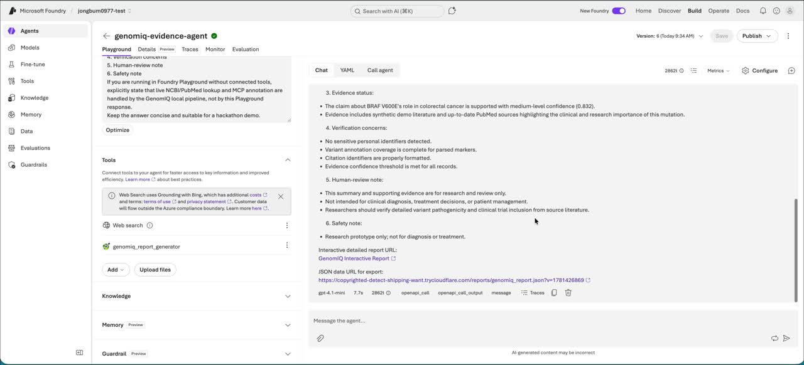

# GenomIQ Evidence Visualizer

Research-grade multi-agent genomic variant evidence assistant for the Microsoft Agents League Hackathon.

GenomIQ Evidence Visualizer helps precision oncology research teams review synthetic or de-identified genomic variant inputs from free text, coordinate snippets, and VCF-like rows. It normalizes variant input, annotates variants, performs NCBI/PubMed source interpretation, supports an NCBI-derived RAG dataset path, verifies evidence quality, and produces a single-file interactive HTML report.

This is **not a diagnostic system** and must not be used for diagnosis, treatment recommendations, medication advice, screening instructions, or patient-specific clinical decisions.

## Demo Video

[](media/genomiq_demo_captioned.mp4)

The demo shows the Microsoft Foundry Agent calling the GenomIQ OpenAPI tool, running the multi-agent evidence workflow, and opening the generated interactive HTML report. The MP4 includes an English subtitle track; the editable subtitle source is available at [media/genomiq_demo_subtitles.srt](media/genomiq_demo_subtitles.srt).

## Challenge Alignment

Track: **Reasoning Agents / Enterprise Agents**

The project demonstrates:

- **Multi-step reasoning** across specialized agents.
- **Microsoft Foundry Agent** integration through a custom OpenAPI tool.
- **External tool/API integration** through NCBI E-utilities for dbSNP and PubMed.
- **RAG dataset preparation** through a no-cost NCBI/PubMed knowledge builder that can produce uploadable Foundry IQ Markdown.
- **MCP integration** through a no-cost local MCP stdio server exposing `annotate_variant`.
- **Verification and safety gates** for PHI/PII patterns, annotation coverage, citation identifiers, evidence confidence, and human approval.
- **Visualization** through an interactive clinical-style HTML report.
- **Cost governance** by avoiding paid Bing Grounding, Azure AI Search, or real workplace data in the public demo.

Microsoft IQ positioning:

- The public demo is intentionally cost-safe and does not require a paid Foundry IQ / Azure AI Search knowledge resource.
- The evidence retrieval interface can be connected to a Foundry Agent with Foundry IQ-backed knowledge in an approved environment.
- Work IQ / Microsoft 365 context is represented by a synthetic, permission-scoped adapter in the public repo because real Work IQ requires tenant policy, licensing, and admin consent.

## Architecture

```text
Foundry Agent Playground
  -> OpenAPI tool: generate_genomiq_report
  -> GenomIQ local API wrapper
  -> Multi-agent backend
     -> Input normalization
     -> MCP variant annotation
     -> NCBI dbSNP source interpretation
     -> PubMed evidence retrieval
     -> Work-context adapter
     -> Disease-network reasoning
     -> Verification and safety review
     -> Human-approved report export
  -> Interactive HTML report URL
```

## Agent Workflow

The backend coordinates these roles:

1. **Metadata Survey Agent**: creates synthetic demographic and family-history context.
2. **Variant Parser Agent**: extracts markers from free text, coordinates, and VCF-like rows.
3. **Variant Annotation Agent**: annotates chromosome, coordinate, allele, gene, dbSNP ID, and consequence through the local MCP tool boundary.
4. **Literature Citation Agent**: retrieves demo evidence and optional live PubMed metadata.
5. **NCBI Source Interpretation Agent**: summarizes dbSNP and PubMed source hits without inventing unsupported claims.
6. **Verification Agent**: checks PHI/PII patterns, annotation coverage, citation ID format, and evidence confidence.
7. **Work Context Agent**: adds synthetic permission-scoped research context.
8. **Disease Network Reasoning Agent**: ranks top disease vulnerability hypotheses from variant/pathway relationships.
9. **Metadata Weighting Agent**: adjusts scores using synthetic metadata modifiers.
10. **Health Guidance Agent**: provides non-diagnostic wellness and review guidance.
11. **Safety Reviewer Agent**: blocks unsupported or sensitive export.
12. **Visual Report Agent**: renders the interactive HTML and structured JSON report.

## Quick Demo

Offline deterministic demo:

```bash
PYTHONPATH=src python3 -m genomiq.orchestrator \
  --case examples/synthetic_case.txt \
  --auto-approve
```

Live NCBI/PubMed source interpretation demo:

```bash
PYTHONPATH=src python3 -m genomiq.orchestrator \
  --case examples/braf_colorectal_case.txt \
  --auto-approve \
  --use-ncbi-live \
  --use-pubmed-live
```

Generated files:

```text
artifacts/genomiq_interactive_report.html
artifacts/genomiq_report.json
```

## NCBI RAG Dataset Builder

The project includes a seed-driven NCBI dataset builder so disease association evidence can expand beyond a single hard-coded demo pathway.

Generate an uploadable Markdown knowledge file from representative variant-disease seed queries:

```bash
python3 scripts/build_ncbi_rag_dataset.py \
  --seed knowledge/variant_seed_queries.json \
  --out knowledge/ncbi_variant_rag_dataset.md \
  --retmax 3
```

Cost-safe template mode, without live NCBI calls:

```bash
python3 scripts/build_ncbi_rag_dataset.py --offline
```

The generated file is intended for:

- optional upload into **Foundry IQ** as a knowledge source,
- local review of PubMed/dbSNP source candidates,
- demo evidence expansion across BRAF, KRAS, APC, MLH1, BRCA1, and TP53 research topics.

NCBI records are treated as evidence candidates, not final clinical truth. GenomIQ still applies coordinate normalization, verification checks, and human approval before export.

## Foundry OpenAPI Tool Demo

Start the local API wrapper:

```bash
PYTHONPATH=src python3 api_server.py
```

Expose it to Foundry with a free tunnel during the demo:

```bash
cloudflared tunnel --url http://localhost:8000
```

Register the tunnel OpenAPI URL in Foundry:

```text
https://<your-tunnel>.trycloudflare.com/openapi.json
```

Foundry tool request:

```text
Use the generate_genomiq_report tool.

case_text:
Synthetic de-identified VCF-like input:
#CHROM POS ID REF ALT QUAL FILTER INFO
7 182734 . A G 100 PASS .
Additional marker: BRCA1

use_ncbi_live: true
use_pubmed_live: true
approved_for_export: true

Return parsed variants, dbSNP IDs, PubMed IDs, verification findings, and the report URL.
```

The Playground response returns a report link such as:

```text
https://<your-tunnel>.trycloudflare.com/reports/genomiq_interactive_report.html?v=...
```

The interactive HTML report is opened from that link rather than rendered inside the chat bubble.

## Local MCP Server

Run the no-cost MCP stdio server:

```bash
PYTHONPATH=src python3 mcp_servers/genomiq_variant_server.py
```

Tool:

```text
annotate_variant
```

Example arguments:

```json
{
  "variant": "chr7:182734:A>G"
}
```

The server returns structured annotation fields. It uses deterministic local fallback data by default and can call NCBI dbSNP when `GENOMIQ_USE_NCBI_LIVE=true`.

## Safety Boundaries

- Research prototype only.
- Synthetic or de-identified data only.
- No PHI, PII, secrets, API keys, connection strings, or confidential workplace data are committed.
- Real Work IQ / Microsoft 365 data is not queried in the public demo.
- Low-confidence or uncited claims are blocked from export.
- Human approval is required before report export.
- Visual markers are illustrative and deterministic, not clinical image interpretation.

## Cost Notes

- No paid Bing Grounding is used.
- No paid Azure AI Search / Foundry IQ resource is required for the public demo.
- NCBI E-utilities are used as a low-cost source interpretation path with optional `NCBI_API_KEY` for local rate-limit management.
- The OpenAPI tunnel is intended for temporary hackathon demonstration, not production hosting.

## Optional Azure Configuration

Optional Foundry Agent / Foundry IQ path:

```bash
export PROJECT_ENDPOINT="https://..."
export MODEL_DEPLOYMENT_NAME="gpt-4.1"
export GENOMIQ_USE_AZURE_FOUNDRY="true"
export GENOMIQ_FOUNDRY_AGENT_NAME="genomiq-evidence-agent"
export GENOMIQ_USE_REAL_WORKIQ="false"
```

Optional dependencies:

```bash
pip install ".[azure]"
az login
```

Do not commit `.env` files. Use `.env.example` as a template.

## Repository Layout

```text
api_server.py                         OpenAPI wrapper for Foundry tool calls
assets/clinical_body_template.png     Embedded report body template
examples/synthetic_case.txt           Offline deterministic demo input
examples/vcf_coordinate_case.txt      VCF-like NCBI/PubMed demo input
knowledge/genomiq_demo_knowledge.md   Optional Foundry IQ uploadable demo knowledge
knowledge/variant_seed_queries.json   Representative NCBI query seeds
scripts/build_ncbi_rag_dataset.py      NCBI/PubMed RAG dataset builder
mcp_servers/genomiq_variant_server.py Local MCP stdio server
src/genomiq/
  agents.py                           Multi-agent orchestration
  approval.py                         Human-in-the-loop gate
  evidence.py                         Demo, PubMed, and optional Foundry evidence retrieval
  input_extractor.py                   Free text, coordinate, and VCF-like extraction
  mcp_tools.py                         Variant annotation tool logic
  orchestrator.py                      CLI demo runner
  parser.py                            Structured case parser
  risk.py                              Evidence scoring and safety gating
  schema.py                            Data contracts
  visualizer.py                        Single-file HTML report generator
  work_context.py                      Synthetic Work IQ-style context adapter
tests/test_pipeline.py                 Local validation tests
```

## Test

```bash
PYTHONPATH=src python3 -m py_compile src/genomiq/*.py api_server.py mcp_servers/genomiq_variant_server.py
PYTHONPATH=src python3 -m unittest discover -s tests -v
```

## Submission Summary

GenomIQ Evidence Visualizer is a research-grade multi-agent system that combines Microsoft Foundry Agents, a custom OpenAPI tool, local MCP-based variant annotation, NCBI/PubMed source interpretation, verification gates, human approval, and an interactive report to support safer genomic variant evidence review.
